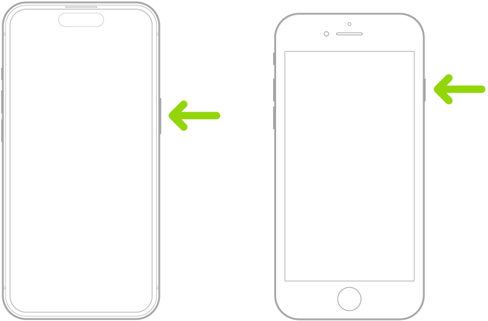
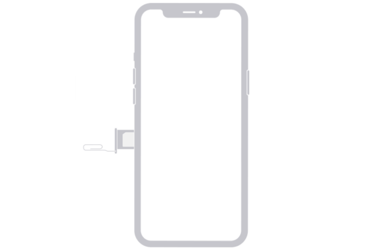
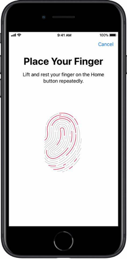

# WRD-204-Technical-Instructions
# Technical Report: Configure an iPhone

**Volodimir Luchan**  
**WRD 204: Technical Writing**  
**Professor Aleshia Jefferson**  
**March 16, 2024**  

---

# **Configure an iPhone**

## Overview

Follow the instructions below to set up your new iPhone and begin to make it your own.

## **Introduction**

This report is geared towards iPhone buyers of all ages, with various experience. Whether it is your first interaction with an iPhone or an experienced user, this report is geared towards helping you efficiently set-up your iPhone without a hassle.

---

## Section 1: How to unbox and Initially setup your iPhone

Unbox your iPhone. Inside you will find a couple of items, such as:
- Charger
- iPhone
- Apple sticker + information packet
- needle

Press and hold the power button (Seen on **Figure 1**) until the Apple logo appears. This will turn the iPhone on.

---

## Section 2: How to Find a Signal

Now the iPhone will need an internet connection to continue. Only two types of connections are allowed: either a Wi-Fi connection or a connection via cellular service. Choose the option you need accordingly.

- **Option 1:** How to Connect through Wi-Fi:
  - Connect the iPhone to your Wi-Fi by choosing your Wi-Fi network from the list of networks found by the iPhone (a password may be required if your network requires it for connection).

- **Option 2:** Using cellular service:
  - Using the needle provided in the box, insert the needle into the hole on the left side of the iPhone. A small platform will pop out. Input your SIM card and then push the platform back into its place.

---

## Section 3: Apple ID setup

**After turning on the iPhone and finding a connection, you will be prompted to input your Apple ID or create one to move forward. Based on what you need, choose one of the options and fill in the required fields to move forward.**

- **Option 1:** Signing in?
  - Input your Apple ID email and password and continue.

- **Option 2:** Do not have an Account?
  - Click “Create Account,” fill in the required fields (email, password, security questions, etc.), and then continue.

---

## Section 4: Security

### **Creating a Password**

Choose one of the four options to decide what type of password you want.

- **Option 1:** 4-digit passcode:
  - Create a 4-digit pin code that you will remember and use to gain access to your iPhone. Ensure it is something only you will know and not easily accessible.

- **Option 2:** 6-digit passcode:
  - Create a 6-digit pin code that you will remember and use to gain access to your iPhone. Ensure it is something only you will know and not easily accessible.

- **Option 3:** Alphabetic passcode:
  - Create an alphabetic password that you will remember and use to gain access to your iPhone. Ensure it is something only you will know and not easily accessible.

- **Option 4:** No passcode:
  - No action required, click continue.

### **Using Touch ID**

  
  

    "Follow the on-screen prompts to add your finger to the system.
    
    **Note:** To make sure you are on the correct screen, please refer to Figure 2. Adding your fingerprint will allow you to unlock your iPhone by scanning your finger on the home button."
  

