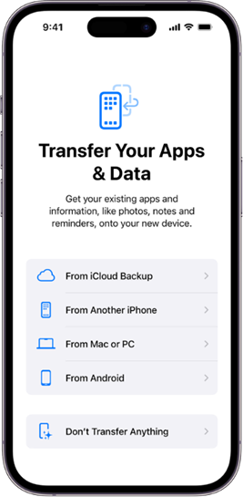

# WRD-204-Technical-Instructions
# Technical Report: Configure an iPhone

**Volodimir Luchan**  
**WRD 204: Technical Writing**  
**Professor Aleshia Jefferson**  
**March 16, 2024**  

---

# **Configure an iPhone**

## Overview

Follow the instructions below to set up your new iPhone and begin to make it your own.

## **Introduction**

This report is geared towards iPhone buyers of all ages, with various experience. Whether it is your first interaction with an iPhone or an experienced user, this report is geared towards helping you efficiently set-up your iPhone without a hassle.

---

## Section 1: How to unbox and Initially setup your iPhone

Unbox your iPhone. Inside you will find a couple of items, such as:
- Charger
- iPhone
- Apple sticker + information packet
- needle

Press and hold the power button (Seen on *Figure 1*) until the Apple logo appears. This will turn the iPhone on.

***Figure 1:** Turning iPhone on*

---

## Section 2: How to Find a Signal

Now the iPhone will need an internet connection to continue. Only two types of connections are allowed: either a Wi-Fi connection or a connection via cellular service. Choose the option you need accordingly.

- **Option 1:** How to Connect through Wi-Fi:
  - Connect the iPhone to your Wi-Fi by choosing your Wi-Fi network from the list of networks found by the iPhone (a password may be required if your network requires it for connection).

- **Option 2:** Using cellular service:
  - Using the needle provided in the box, insert the needle into the hole on the left side of the iPhone. A small platform will pop out. Input your SIM card and then push the platform back into its place. (Refer to *Figure 2* for location of SIM card)

***Figure 2:** Inserting SIM card*

---

## Section 3: Apple ID setup

**After turning on the iPhone and finding a connection, you will be prompted to input your Apple ID or create one to move forward. Based on what you need, choose one of the options and fill in the required fields to move forward.**

- **Option 1:** Signing in?
  - Input your Apple ID email and password and continue.

- **Option 2:** Do not have an Account?
  - Click “Create Account,” fill in the required fields (email, password, security questions, etc.), and then continue.

---

## Section 4: Security

### **Creating a Password**

Choose one of the four options to decide what type of password you want.

- **Option 1:** 4-digit passcode:
  - Create a 4-digit pin code that you will remember and use to gain access to your iPhone. Ensure it is something only you will know and not easily accessible.

- **Option 2:** 6-digit passcode:
  - Create a 6-digit pin code that you will remember and use to gain access to your iPhone. Ensure it is something only you will know and not easily accessible.

- **Option 3:** Alphabetic passcode:
  - Create an alphabetic password that you will remember and use to gain access to your iPhone. Ensure it is something only you will know and not easily accessible.

- **Option 4:** No passcode:
  - No action required, click continue.

### **Using Touch ID**

Follow the on-screen prompts to add your finger to the system.

**Note:** To make sure you are on the correct screen, please refer to *Figure 3*. Adding your fingerprint will allow you to unlock your iPhone by scanning your finger on the home button.

  
***Figure 3:** Touch ID Setup*

### **Using Face ID**

Follow the on-screen prompts to add your face to the system.

**Note:** To make sure you are on the correct screen, please refer to *Figure 4*. Adding your Face ID will allow you to unlock your iPhone by scanning your face through your iPhone camera.

  
***Figure 4:** Face ID Setup*

---

### **Section 5: Data Transfer**

Choose one of the options to transfer your data from. If you are a first-time user and do not have any data to transfer, click the last option, “Don’t Transfer Anything.” Otherwise, choose from one of the other options provided.

**Note:** To make sure you are on the correct screen, please refer to *Figure 5*.

  
***Figure 5:** Data Transfer Options*

- **Option 1:** iCloud Backup?
  - This choice is used if you have had an iPhone previously and saved all your data in iCloud. It will directly transfer your most recent data from iCloud to the new iPhone. It is mostly used if you do not own or are in possession of your old iPhone.

- **Option 2:** Another iPhone?
  - If you currently possess your old iPhone, use this option to transfer your information from your iPhone to the new one.

- **Option 3:** From Mac or PC?
  - If you have information loaded onto your Mac or PC, use this option to transfer the information from the computer to your new iPhone.

- **Option 4:** From Android?
  - If you previously had an Android, you could use this option to transfer all your data to your new iPhone, allowing you to transfer all your information with no fuss.

---

### **Section 6: Personalization**

You can customize your iPhone in many ways, ranging from wallpapers to the size of apps and fonts. To adjust all this information, find and click on your Settings app on your iPhone, then proceed to the corresponding section and adjust the settings to your needs. (Refer to *Figure 6* for an image of the Settings App)

  
***Figure 6:** Settings App*

---

### **Section 7: Installing Apps**

Many apps will already be installed on your iPhone for convenience. To install other apps, click on the App Store app, and use the search bar to find the app you need. Then click download. The app will appear on your home screen. (Refer to *Figure 7* for an image of the App Store app)

  
***Figure 7:** App Store App*

---

## **Summary**

This concludes the set-up process of an iPhone, if more help is needed visit https://support.apple.com. There you can find more information on more specific topics as well as personalization and customization features on iPhones, as well as how to use and add them. You may also find additional support using the chat room or by calling Apple Support. 

---

## **References**

https://www.markdownguide.org/basic-syntax/

https://support.apple.com/guide/iphone/welcome/ios

*Technical Instructions in Word Doc;*

https://depauledu-my.sharepoint.com/:w:/g/personal/vluchan_depaul_edu/ETZIS8H7rtJNoAi9t1nOMLoBQ8nLrBmPkV6oLFChuq2xmQ?e=ik7QXU

